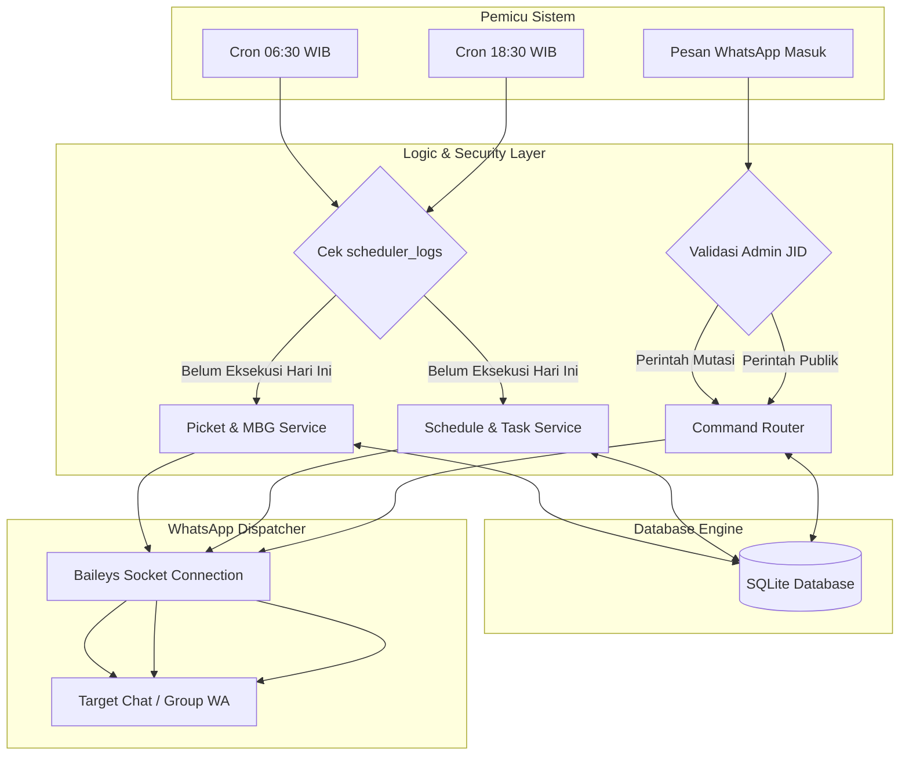
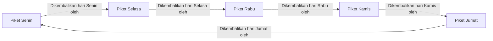

<div align="center">

# CLASS ASSISTANT — XII TJKT 1
### WhatsApp Automation Bot for School Schedule & Tasks Management

[](https://nodejs.org/)
[](https://www.sqlite.org/)
[](https://github.com/WhiskeySockets/Baileys)
[](https://www.npmjs.com/package/node-cron)
[](https://pm2.keymetrics.io/)
[](LICENSE)

<p align="center">
  <b>Simple</b> • <b>Lightweight</b> • <b>Reliable</b> • <b>Easy to Maintain</b>
</p>

</div>

---

## Authors & Collaborators

<div align="center">

<table>
  <tr>
    <td align="center" width="220">
      <a href="https://github.com/fendyramadhani9-cloud">
        <br />
        <sub><b>Fendy Ramadhani</b></sub>
      </a>
      <br />
      <a href="https://github.com/fendyramadhani9-cloud">
        
      </a>
    </td>
    <td align="center" width="220">
      <a href="https://github.com/Deri-Nugroho">
        <br />
        <sub><b>Deri Nugroho</b></sub>
      </a>
      <br />
      <a href="https://github.com/Deri-Nugroho">
        
      </a>
    </td>
  </tr>
</table>

</div>

---

## System Architecture & Workflow



---

## Daily Routine & Timeline

```mermaid
gantt
    title Jadwal Harian Otomatis Bot (Asia/Jakarta)
    dateFormat HH:mm
    axisFormat %H:%M

    section Pagi Hari
    Pengingat Piket & MBG (06:30)           :active, 06:30, 06:35
    Pengumuman Kas Rp5.000 (Khusus Rabu)    :crit, 06:30, 06:35

    section Sore Hari
    Jadwal & Tugas Besok (18:30)            :active, 18:30, 18:35
    Jumat Sore (Skip Hari Sabtu)            :done, 18:30, 18:35
```



---

## Siklus Logika Pengembalian MBG

Sistem memastikan pengembalian MBG dilakukan tepat waktu oleh regu piket hari berikutnya pada hari yang sama:



---

## Daftar Perintah (Command Cheatsheet)

### Perintah Publik (Semua Siswa)

| Perintah | Fungsi | Contoh |
|---|---|---|
| `@help` | Melihat panduan penggunaan | `@help` |
| `@jadwal [hari]` | Melihat jadwal & tugas hari tertentu | `@jadwal Senin` / `@jadwal` |
| `@listtugas` / `@list` | Melihat semua tugas aktif | `@listtugas` |

### Perintah Khusus Admin

*Hanya nomor terdaftar di `ADMIN_NUMBER` yang dapat melakukan mutasi data.*

#### 1. Tambah Tugas (`@tugas`)
Mendukung input alias toleran typo/huruf kecil (`mtk`, `bing`, `indo`, `devops`, `cyber`, dll). Kode unik otomatis dibuat (`MTK-01`, `MTK-02`, dst.).
```text
@tugas
Mapel : Matematika
Tugas : Mencatat materi
Deadline : Besok
Catatan : Bawa buku berpetak
```

#### 2. Edit Tugas (`@edit`)
```text
@edit MTK-01
Tugas : Latihan Soal Translasi
Deadline : Jumat
Catatan : Jangan lupa kalkulator
```

#### 3. Hapus Tugas (`@hapus`)
```text
@hapus MTK-01
```

#### 4. Update Materi (`@materi`)
```text
@materi MTK : Translasi
```

---

## Panduan Instalasi & Menjalankan

### 1. Prasyarat
- Node.js v20+
- Git

### 2. Clone & Install
```bash
git clone https://github.com/fendyramadhani9-cloud/Bot-tugas-reminder.git
cd Bot-tugas-reminder
npm install
```

### 3. Konfigurasi `.env`
Salin template:
```bash
cp .env.example .env
```
Isi variabel:
```env
WA_TARGET_CHAT_ID=12036304xxxxxxxxxx@g.us
ADMIN_NUMBER=6281234567890
TIMEZONE=Asia/Jakarta
```

### 4. Jalankan (Scan QR Login)
```bash
npm start
```
Scan QR yang muncul di terminal melalui WhatsApp di ponsel (**Perangkat Tertaut**).

---

## Deployment Server / Proxmox (PM2)

```bash
# Install PM2
npm install -g pm2

# Start Bot di background
pm2 start src/index.js --name class-assistant

# Simpan state & autostart saat boot
pm2 save
pm2 startup
```

---

## Testing

Jalankan test suite untuk memvalidasi database, format pesan, MBG logic, dan scheduler:
```bash
npm test
```

---

## License

Didistribusikan di bawah [MIT License](LICENSE). Copyright (c) 2026 **Fendy Ramadhani** & **Deri Nugroho**.
